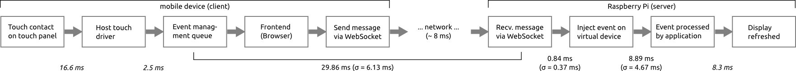
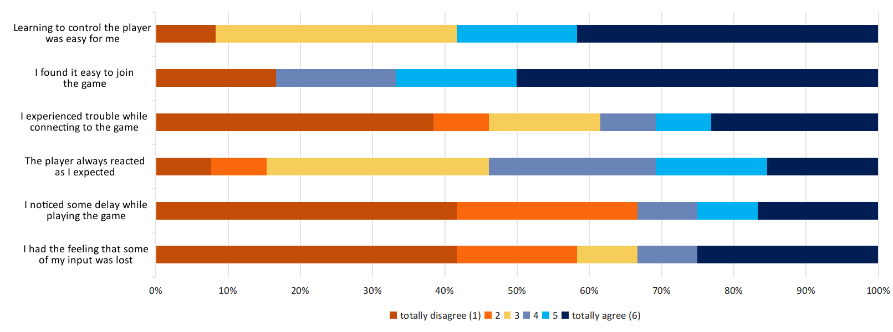

# The Massive Mobile Multiuser Framework: Enabling Ad-Hoc Realtime Interaction with Public Displays

### Tim Weißker, Andreas Berst, Johannes Hartmann, Florian Echtler

Abstract
========
In this paper, we present the Massive Mobile Multiuser (M³) framework, a
software platform designed to enable setup-free, real-time, concurrent
interaction with shared public displays through large numbers of
personal mobile devices. This work is motivated by the fact that
simultaneous interaction of multiple persons with public displays
requires either dedicated tracking hardware to detect gestures or touch,
or a way for users to interact through their personal mobile devices.
The latter option provides more flexibility but also presents a
heightened entry barrier as it often requires installation of custom
software.

To address these issues, M³ enables immediate interaction through the
mobile browser without requiring prior setup on the user side, and
real-time interaction suitable for fast multiplayer games. We present a
detailed analysis of latency sources and findings from two real-world
deployments of our framework in public settings with up to 17 concurrent
users. Despite a resource-constrained environment and an unpredictable
selection of client devices, M³ consistently delivers performance
suitable for real-time interaction.

Introduction and Motivation
===========================

Although public displays have become a common sight in recent years for
applications such as advertisements and entertainment, these displays
are still mostly passive information sources. Various approaches exist
to enable interaction with such devices, in particular focusing on touch
and gestures as interface modalities. However, these options usually
offer only a limited set of actions (gestures), cannot be scaled to
arbitrary display sizes (touch), or offer only limited support for
multiple concurrent users (both). If a more complex interface with
multi-user support is desired, particularly for large groups of 10 or
more users, an alternative is to employ the users’ personal mobile
devices. Unfortunately, this approach suffers from a heightened entry
barrier as users are usually required to install a custom app before
interaction is possible. A recent example for such a scenario is
TextBlaster by Vertanen et al. \[22\]. Given that only a short time
window is available to engage potential users in a walk-up-and-use
scenario \[15\], the end result is often that no interaction will take
place after all.

To address these issues, we present the Massive Mobile Multiuser (M³)
framework, which allows setup-free, real-time interaction with public
displays by utilizing the mobile browser. Depending on the scenario,
users only have to visit a web page, which may be presented via a short
printed URL or a QR code to start interacting. In particular, our system
has sufficiently low latency to enable interaction even with fast-paced
multiplayer games. Although a large body of research on this topic
exists, our approach is, to our knowledge, the first to combine
setup-free interaction, real-time capabilities and support for a large
number of concurrent users.

In this paper, we give an overview of the architecture of M³, describe
our analysis and measurements of the system’s latency, and present our
findings from two real-world deployments in a resource-constrained
environment with 97 distinct users (up to 17 concurrently). The API as
well as all source code for the framework and the sample game is
available under an open-source license at
<https://github.com/mmbuw/massive-mobile-multiplayer>. A video showing
live interaction of 17 participants at a public event is available at
<https://www.youtube.com/watch?v=niA5Vwu3BtE>.

Related Work
============

Interaction with public displays is a topic which has already been
explored by numerous researchers, although not in the combination of
features we focus on (no setup, real-time interaction, multiple users).
We identify three main directions of research pertinent to our approach:
vision-based and browser-based interaction using personal mobile
devices, and gestural interaction using sensors embedded into the
display.

Vision-based interaction usually employs an approach where the public
display is viewed through a live video feed on the mobile device and
interaction is done through touch on the video representation. A seminal
example is Touch Projector by Boring et al. \[4\] although earlier work
by Ballagas et al. \[3\] already presented a similar approach on
non-touch devices. Common limitations of this approach are that it
requires a custom app to be installed before interaction can take place,
and that the mobile device has to be held in a camera-like pose to
enable interaction.

Browser-based interaction, on the other hand, emphasizes the aspect of
requiring no setup prior to interaction, which is performed through the
pre-installed web browser on the mobile device. For example, Kubitza et
al. present VEII \[13,14\], which allows on-site modificiation of public
displays in museums through a mobile device. Alt et al. present
Digifieds \[1,2\], a framework to exchange content with public digital
notice boards using a combination of mobile apps and custom websites.
Geel et al. show PresiShare \[10\], a setup-less web application for
mobile devices, which uses QR codes to share media on multiple public
displays. MoCHA, a modular web-based multi-device framework by Oat et
al. uses QR codes to establish the connection between client and server
\[19\].

Dingler et al. present uCanvas \[7\], a web-based framework to employ
the mobile device’s accelerometer for interaction with the public
display. In the context of collaborative music creation, Weitzner et al.
developed MassMobile \[23\], an audience participation framework
designed to control a large Max/MSP installation. Also, recent versions
of the Android operating system include Google Nearby \[11\], an API
designed to enable interaction between co-located smartphones and
optionally also shared displays. The latter approach, however, again
requires prior installation of a custom app and is not
platform-independent.

Both the smartphone-camera- and browser-based research directions do not
seem to focus on simultaneous real-time interaction from multiple users.
Although both approaches should in theory be capable of supporting
multiple concurrent users, this has not been investigated extensively.
When multi-user capability is desired, most research currently centers
around gesture-based interaction using sensors such as the Kinect. One
current example is ShadowTouch by Elhart et al. \[8\], in which the
users’ silhouettes are overlaid over the display and augmented with
individual selection menus. A similar approach with depth cameras,
focusing on a playful experience in a shop window for multiple
passersby, was presented by Müller et al. \[17\].

Architecture of M³ Framework
============================

The M³ Framework consists of a *client-server architecture*, in which a
server performs the application logic and renders a visualization of its
internal model to the shared public display. The mobile client devices
collect inputs from their respective users for manipulating this model
and forward them to the server using a wireless communication channel.
Following these principles, our framework consists of three modules.
While the *frontend* runs on the client devices, the *backend* and the
*application* are deployed on the server. The relationships between
these modules are illustrated in Figure \[fig:system-architecture\].

Frontend
--------

When a user wants to participate, they wirelessly connect their mobile
device to the server. By opening a specific URL in a browser, the
connected client is supplied with the *front-end* module of the
framework via a regular web server. This module opens a *WebSocket*
\[9\] connection to the backend for realtime communication. In order to
collect input data from the user, it displays a virtual input device
interface using HTML5 and JavaScript. Examples for simulated input
device interfaces include a virtual keyboard or a game controller. The
frontend currently supports the mobile Firefox, Safari and Chrome
browsers. As the concrete appearance of this mobile interface depends on
the intended usage scenario, it is the task of the developer to create
the involved UI elements together with their touch event handling. After
a touch has been recognized, the framework specifies the encoding of
messages to be sent to the server via the WebSocket connection.

Backend
-------

The Linux-based *backend* module is the core of the framework, which
runs on the server and waits for incoming WebSocket connections by
mobile client devices. When a new connection is established, this module
creates an event device using the *uinput* library, which allows dynamic
creation of virtual input devices. Each incoming message from a client
is then interpreted, and the corresponding event is triggered on the
respective event device. Before compilation of the backend module, the
allowed event types, event codes and corresponding WebSocket messages
can be customized in a configuration file by the developer.

The configuration file in Listing \[lst:config-code\], for example,
defines event devices producing continuous absolute values in
two-dimensional space and a discrete button value.

    type EV_ABS AB
    event ABS_X X 
    event ABS_Y Y

    type EV_KEY K
    event BTN_A A

This specification of events also defines the plain-text protocol for
the respective socket messages. According to Listing
\[lst:config-code\], examples for valid socket messages include
`^EV_ABS ABS_X 111$` and `^EV_KEY BTN_A 1$` for injecting single events
and `^EV_ABS * 111 222$` for multiple ones in a single message. The
third word at the end of a configuration line defines an alias for the
corresponding type or event, which may help to reduce the amount of data
sent via the socket. Consequently, `^AB X 123$` is also a valid message,
which is equivalent to the first example. The caret and dollar signs are
delimiters to detect corrupted messages.

Application
-----------

The task of the *application* module is to provide an internal model,
which is visualized on the shared public display and can be modified by
the client devices. This module runs on the server and waits for new
event devices to appear. For each of these devices, it maps the incoming
events to changes in the internal model using an appropriate transfer
function. As a result, the coupling of the application to the backend
module is only given by the *evdev* interface and therefore is very
loose, which makes the application easily exchangeable according to the
intended usage context. The framework provides the user with an
extensible application skeleton, which is able to react to new devices
and read their inputs. As the application itself obviously depends on
the usage context of the framework, it needs to be fully created by the
developer. Note that due to the use of the standard Linux *evdev*
interface, all potential applications could also utilize standard
physical input devices like game pads connected via USB.

Analysis of Latency Sources
===========================

In order to determine the viability of our approach for real-time
interaction, we analyzed the total latency of the system. To this end,
we deployed the server modules of the $M^3$ framework on a *Raspberry
Pi* to mirror the intended usage scenario as a low-power gaming
appliance. Our main test client was a *Samsung GT-I8190* running
*Chrome* on *Android 4.1.2*, which connected to the server using a WiFi
network provided directly by the server through an USB WiFi adapter
acting as access point. The frontend module was delivered by an
*Apache2* web server. In our test setup, it provided an interface with a
single touch button, which made a corresponding circle on the shared
public screen flash up. Our goal was to estimate the total time a touch
contact on the mobile device required to be recognized, processed and
displayed on the shared public screen. The results of our latency
analysis are illustrated in Figure \[fig:latency-sources\]. It can be
divided into the processing times solely introduced by $M^3$ framework
itself plus additional times dependent on the mobile device, the network
and the public display in use.

Framework components
--------------------

An event arriving at the mobile operating system’s event management
queue needs to be forwarded to the frontend module of $M^3$ running in
the web browser, which then recognizes that the button on the virtual
input device was pressed. This information is encoded in a message and
sent to the server over the WebSocket connection. In order to quantify
the time needed for these steps, we wrote a script for the
*monkeyrunner* UI testing tool, which injected 100 touch events into the
event pipeline in irregular intervals. By computing the time difference
between event injection and network packet arrival at the Raspberry Pi
server (using the *tcpdump* network capturing utility), we measured an
average duration of 29.86 ms (standard deviation $\sigma$ = 6.13 ms) for
these components. Further tests involving more modern client devices
revealed that the time from event management queue to network packet
arrival on the server can be even lower, going down to 12.12 ms
($\sigma$ = 2.73 ms) on a Google Nexus 4.

When a network packet arrives on the server, it needs to be processed by
the backend module of $M^3$, and the intended event needs to be
triggered on the corresponding event device. We measured 100 time
differences between the arrival of a network packet and the time stamp
of the triggered event, resulting in an average latency of 0.84 ms
($\sigma$ = 0.37 ms) for the backend module.

In the last step, the application module needs some additional time to
react to the triggered event on the event device. In our example, we
therefore measured the time differences between an event’s time stamp
and the time of the method call coloring the circle on the shared public
display. As our application’s main loop runs at 60Hz, we expected a
worst case time of 16.67 ms for this step. Measurements with 100 events
resulted in an average of 8.89 ms ($\sigma$ = 4.67 ms), confirming this
expectation.

External components
-------------------

For our previous analyses, we injected touch events artificially using
the *monkeyrunner* tool. However, in real-world deployments of our
architecture, touch events are generated by the user; thus, we need to
examine the time which is needed to recognize touches on the mobile
device’s touch layer and to forward them to the event queue. This is
extensively discussed by Padre \[20\] and Chang \[5\], which leads us to
assume an average latency of 16.6 ms for the touchscreen (considering
the touchscreen itself is sampled at 100 Hz, but internally synchronized
to the LCD refresh rate of 60 Hz, which results in slightly varying
response times to a touch), plus an additional 2.5 ms for internal
preprocessing.

Finally, we also need to take the refresh rate of the public display
into account, which introduces some additional time after the draw call
coloring the circle until the actual noticeable color change on the
screen. If, like in our case, the public display runs at a refresh rate
of 60Hz, another 8.3 ms latency need to be assumed on average (16.67 ms
in the worst case).

Interpretation and discussion
-----------------------------

Until recently, interactive systems aimed to achieve latency below 100
ms according to Wickens \[24\]. However, more recent work by Ivkovic et
al. \[12\] showed that user performance in targeting and tracking tasks
already begins to decline slightly at latencies around 70 ms when
compared to a baseline latency of 11 ms. Using a custom high-speed touch
sensor and output system, Ng et al. showed that even latencies below 10
ms can still be noticed by some users \[18\]. However, as we are
targeting commodity hardware, we consequently aimed for a total system
latency below 70 ms to avoid impeding user performance. The measured
components of $M^3$ framework total up to 39.59 ms (Samsung GT-I8190)
and 21.85 ms (Google Nexus 4). Even when adding the estimated latencies
introduced by external components, we still achieve an estimated latency
of 66.99 ms for the older Samsung device and 49.25 ms for the more
modern Nexus device.

As a result, we can state that our setup is fully compatible with
applications requiring real-time communication. Although our analysis
focused on Android devices due to their better-documented internals,
comparable performance was observed on a variety of iOS-based devices
during our real-world deployments.[^1]

As mentioned before, the illustrated values were measured with client
devices directly connected to the server using a WiFi connection without
additional network hops. Naturally, when the network complexity is
higher, the resulting additional latency needs to be added to the total,
as also indicated in earlier research by Clinch et al. \[6\]. In an
additional experiment, we connected the server to the Internet and
measured an average round-trip time of 111.50 ms ($\sigma$ = 61.38 ms)
over a 4G connection, resulting in approximately 55 ms of additional
latency. Compared to the average round-trip time of 15.77 ms ($\sigma$ =
7.94 ms) for the local WiFi network which consequently contributes about
8 ms of latency, this is a noticeable difference, which is likely even
larger when an earlier-generation network is used. Consequently, when
real-time interaction is required, we suggest using a local WiFi
network; otherwise, connecting to the server via the Internet may be a
viable alternative.

Real-World Deployment of M³
===========================

In order to evaluate our framework in a real-life setting with
fast-paced multi-user interaction, we implemented a gaming appliance
based on a Raspberry Pi. We assumed that attracting people to test the
interface was easier when using a playful application as opposed to an
artificial test setup or a more work-focused implementation as also
indicated by other research \[16\]. Consequently, we developed a video
game loosely based off *HaxBall*[^2], a simplified 2D soccer variant. It
is well suited as a stress test for our framework as it requires
constant interaction and fast reaction times while allowing players to
join or leave at any time. This game was deployed during an open-lab
event at our university as well as during a digital arts exhibition. For
the actual look of the game, refer to Figure \[fig:teaser\].

The game constantly repeats rounds of 3 minutes duration, which users
can join at any given time. For our system, this is done by simply
joining our WiFi network and accessing any arbitrary URL. The user will
then be forwarded to the captive portal page of our game and prompted to
choose a user name. The phone then becomes the user’s controller (see
also figure \[fig:controller-layout\]). Users are auto-assigned to the
blue or the red team based on current score and team size; team color is
also indicated by the UI elements on the frontend. Each user is embodied
by a colored player circle on the field.

Over the course of two days and a total of about 8 hours, we recorded a
total of 143 games with user participation. Note that the framework was
running continuously and without interruptions for the whole time
period. On average, the games were played by 5.36 ($\sigma$ = 3.01)
participants and ended with a total of 5.51 goals scored, which were
nearly equally distributed over the two teams. The average user’s
connection lasted for 305.8 seconds, which equals to roughly 5.1 minutes
or 1.7 games. We recorded a total of 97 different MAC addresses and our
longest connection recorded lasted for 2106 seconds. Note that our
system disconnects inactive users after 30 seconds, so the user had
actually been playing for 35 minutes straight. We received enthusiastic
informal feedback from participants, and several requests to deploy the
game in other contexts such as an office lounge.

To gather additional subjective data, we also redirected users to a
short post-game questionnaire in the browser after they had left the
game or the 30-seconds timeout was reached. This questionnaire was
completed by 13 users out of 97, likely due to the fact that many
participants simply pocketed their phone at the end of the game and left
without further looking at the browser.

We asked our users to rate six aspects of their experience on a 6-point
Likert scale (with 1 representing “totally disagree” and 6 being
“totally agree”). We have illustrated the questions and their respective
scores in Figure \[fig:survey-results\]. The perceived latency and the
feeling that given input got lost were both rated low (median $Mdn$ = 2;
mode $Mo$ = 1), which confirms that $M^3$ framework’s implementation
functions fast and correctly. Furthermore, people found it very easy to
join the game ($Mdn$ = 6; $Mo$ = 6) and also to learn how to control
their player figure on the shared screen ($Mdn$ = 5; $Mo$ = 6). While
most of the people didn’t experience problems during connecting to the
game ($Mdn$ = 3; $Mo$ = 1), the median score indicates that there were
some exceptions. We assume that this value was heavily influenced by the
fact that recent Android phones often automatically disconnect from WiFi
networks that do not provide Internet access, which was the case for our
network. The most negative feedback was given to the question whether
the player figure always reacted to user input as expected ($Mdn$ = 4;
$Mo$ = 3), which we partially lead back to our rather uncommon
acceleration-based transfer function \[25\] supplemented by our friction
simulation.

Conclusion and Future Work
==========================

We have presented the Massive Mobile Multiuser framework, which combines
real-time capabilities and setup-free interaction with public displays
using personal mobile devices. We showed an in-depth analysis of the
system’s total latency and discussed results from two public
deployments, which confirmed our expectation that M³ enables a large
number of users to interact concurrently, in real time, and without
discouraging setup procedures. A central finding from our analysis is
that if a latency budget of at most 70 ms is assumed, “fixed costs” such
as touchscreen and display latency already consume roughly half of this
budget, requiring the use of fast networks such as local WiFi
connections for providing real-time interaction.

The framework is designed in a modular way in order to provide easy
exchangeability of functionalities and use cases. While the source code
for the backend module usually remains constant, the frontend and the
application are strongly dependent on the framework’s usage context.
Going from a 2D to a 3D gaming scenario, another imaginable frontend
could, for example, provide two control sticks for manipulating both the
player’s and the camera’s movements separately. Apart from gaming,
collaborative text editing involving a keyboard frontend might also be
an interesting use case for the framework.

Prior studies suggest that using mobile touch displays as input for
controlling content on larger screens perform better than or equivalent
to mobile-only or hybrid modalities in simple search tasks \[21\].
However, the more complex the mobile frontend becomes, the more
attention shifts between the displays are needed to accomplish a task.
This is mainly due to the need of locating specific interface elements
and the lack of haptic feedback provided by the touch surface. In order
to reduce this number of attention shifts, another interesting extension
to the framework could involve using device motion in the frontend to
supplement touch inputs, similar to \[7\]. As the configurable backend
already supports the full set of input events defined in the Linux
kernel, including accelerometer data, no changes are required there.

Acknowledgments
===============

This work has been presented as a demo at the electronic arts festival
*Evoke 2015*[^3] and at the *CHI 2016* interactivity session.

1\. Florian Alt, Thomas Kubitza, Dominik Bial, et al. 2011. Digifieds:
Insights into deploying digital public notice areas in the wild. In
*Proceedings of the 10th International Conference on Mobile and
Ubiquitous Multimedia* (MUM ’11), 165–174. Retrieved June 23, 2015 from
<http://dl.acm.org/citation.cfm?id=2107618>

2\. Florian Alt, Alireza Sahami Shirazi, Thomas Kubitza, and Albrecht
Schmidt. 2013. Interaction techniques for creating and exchanging
content with public displays. In *Proceedings of the SIGCHI Conference
on Human Factors in Computing Systems* (CHI ’12), 1709–1718. Retrieved
June 23, 2015 from <http://dl.acm.org/citation.cfm?id=2466226>

3\. Rafael Ballagas, Michael Rohs, and Jennifer G. Sheridan. 2005. Sweep
and Point and Shoot: Phonecam-based Interactions for Large Public
Displays. In *CHI ’05 Extended Abstracts on Human Factors in Computing
Systems* (CHI EA ’05), 1200–1203.
<http://doi.org/10.1145/1056808.1056876>

4\. Sebastian Boring, Dominikus Baur, Andreas Butz, Sean Gustafson, and
Patrick Baudisch. 2010. Touch Projector: Mobile Interaction Through
Video. In *Proceedings of the SIGCHI Conference on Human Factors in
Computing Systems* (CHI ’10), 2287–2296.
<http://doi.org/10.1145/1753326.1753671>

5\. Mason Chang. 2014. Android touch resampling algorithm. 

6\. Sarah Clinch, Jan Harkes, Adrian Friday, Nigel Davies, and Mahadev
Satyanarayanan. 2012. How close is close enough? Understanding the role
of cloudlets in supporting display appropriation by mobile users. In
*Pervasive computing and communications (perCom), 2012 iEEE
international conference on*, 122–127.

7\. Tilman Dingler, Tobias Bagg, Yves Grau, Niels Henze, and Albrecht
Schmidt. 2015. uCanvas: A Web Framework for Spontaneous Smartphone
Interaction with Ubiquitous Displays. In *Human-Computer Interaction –
INTERACT 2015*, Julio Abascal, Simone Barbosa, Mirko Fetter, Tom Gross,
Philippe Palanque and Marco Winckler (eds.). Springer International
Publishing, 402–409. Retrieved September 15, 2015 from
<http://link.springer.com/chapter/10.1007/978-3-319-22698-9_27>

8\. Ivan Elhart, Federico Scacchi, Evangelos Niforatos, and Marc
Langheinrich. 2015. ShadowTouch: A Multi-user Application Selection
Interface for Interactive Public Displays. In *Proceedings of the 4th
International Symposium on Pervasive Displays* (PerDis ’15), 209–216.
<http://doi.org/10.1145/2757710.2757735>

9\. Ian Fette and Alexey Melnikov. 2011. The WebSocket Protocol
(RFC6455). 

10\. Matthias Geel, Daniel Huguenin, and Moira C. Norrie. 2013.
PresiShare: Opportunistic Sharing and Presentation of Content Using
Public Displays and QR Codes. In *Proceedings of the 2Nd ACM
International Symposium on Pervasive Displays* (PerDis ’13), 103–108.
<http://doi.org/10.1145/2491568.2491591>

11\. Google, Inc. 2015. Nearby. 

12\. Zenja Ivkovic, Ian Stavness, Carl Gutwin, and Steven Sutcliffe.
2015. Quantifying and mitigating the negative effects of local latencies
on aiming in 3D shooter games. In *Proceedings of the 33rd annual aCM
conference on human factors in computing systems* (CHI ’15), 135–144.
<http://doi.org/10.1145/2702123.2702432>

13\. Thomas Kubitza, Sarah Clinch, Nigel Davies, and Marc Langheinrich.
2013. Using mobile devices to personalize pervasive displays. *ACM
SIGMOBILE Mobile Computing and Communications Review* 16, 4: 26–27.
Retrieved June 23, 2015 from <http://dl.acm.org/citation.cfm?id=2436211>

14\. Thomas Kubitza, Sascha Thullner, and Albrecht Schmidt. 2015. VEII: A
Toolkit for Editing Multimedia Content of Interactive Installations
On-site. In *Proceedings of the 4th International Symposium on Pervasive
Displays* (PerDis ’15), 249–250.
<http://doi.org/10.1145/2757710.2776806>

15\. Jörg Müller, Florian Alt, Daniel Michelis, and Albrecht Schmidt.
2010. Requirements and Design Space for Interactive Public Displays. In
*Proceedings of the International Conference on Multimedia* (MM ’10),
1285–1294. <http://doi.org/10.1145/1873951.1874203>

16\. Jörg Müller, Dieter Eberle, and Konrad Tollmar. 2014. Communiplay: A
Field Study of a Public Display Mediaspace. In *Proceedings of the 32Nd
Annual ACM Conference on Human Factors in Computing Systems* (CHI ’14),
1415–1424. <http://doi.org/10.1145/2556288.2557001>

17\. Jörg Müller, Robert Walter, Gilles Bailly, Michael Nischt, and
Florian Alt. 2012. Looking Glass: A Field Study on Noticing
Interactivity of a Shop Window. In *Proceedings of the SIGCHI Conference
on Human Factors in Computing Systems* (CHI ’12), 297–306.
<http://doi.org/10.1145/2207676.2207718>

18\. Albert Ng, Julian Lepinski, Daniel Wigdor, Steven Sanders, and Paul
Dietz. 2012. Designing for low-latency direct-touch input. In
*Proceedings of the 25th annual aCM symposium on user interface software
and technology* (UIST ’12), 453–464.
<http://doi.org/10.1145/2380116.2380174>

19\. E. Oat, M. Di Francesco, and T. Aura. 2014. MoCHA: Augmenting
pervasive displays through mobile devices and web-based technologies. In
*Pervasive computing and communications workshops (pERCOM workshops),
2014 iEEE international conference on*, 506–511.
<http://doi.org/10.1109/PerComW.2014.6815258>

20\. Joe Padre. 2014. Understanding touch responsiveness - Touchscreen
technology series 2. 

21\. Umar Rashid, Miguel A. Nacenta, and Aaron Quigley. 2012. The cost of
display switching: A comparison of mobile, large display and hybrid uI
configurations. In *Proceedings of the international working conference
on advanced visual interfaces* (AVI ’12), 99–106.
<http://doi.org/10.1145/2254556.2254577>

22\. Keith Vertanen, Justin Emge, Haythem Memmi, and Per Ola Kristensson.
2014. Text blaster: A multi-player touchscreen typing game. In *CHI ’14
extended abstracts on human factors in computing systems* (CHI eA ’14),
379–382. <http://doi.org/10.1145/2559206.2574802>

23\. Nathan Weitzner, Jason Freeman, Yan-Ling Chen, and Stephen Garrett.
2013. massMobile: Towards a flexible framework for large-scale
participatory collaborations in live performances. *Organised Sound* 18,
Special Issue 01: 30–42. <http://doi.org/10.1017/S1355771812000222>

24\. Christopher D. Wickens, Justin G. Hollands, and Raja Parasuraman.
2012. *Engineering Psychology & Human Performance*. CRC Press, Boston.

25\. Shumin Zhai. 1995. Human performance in six degree of freedom input
control. 17–18.

[\[1\]](#footnote-1): Out of 97 total participating devices, 27 were identified as Apple
    devices via their MAC addresses.

[\[2\]](#footnote-2): <http://www.haxball.com>

[\[3\]](#footnote-3): <https://www.evoke.eu/2015/>
